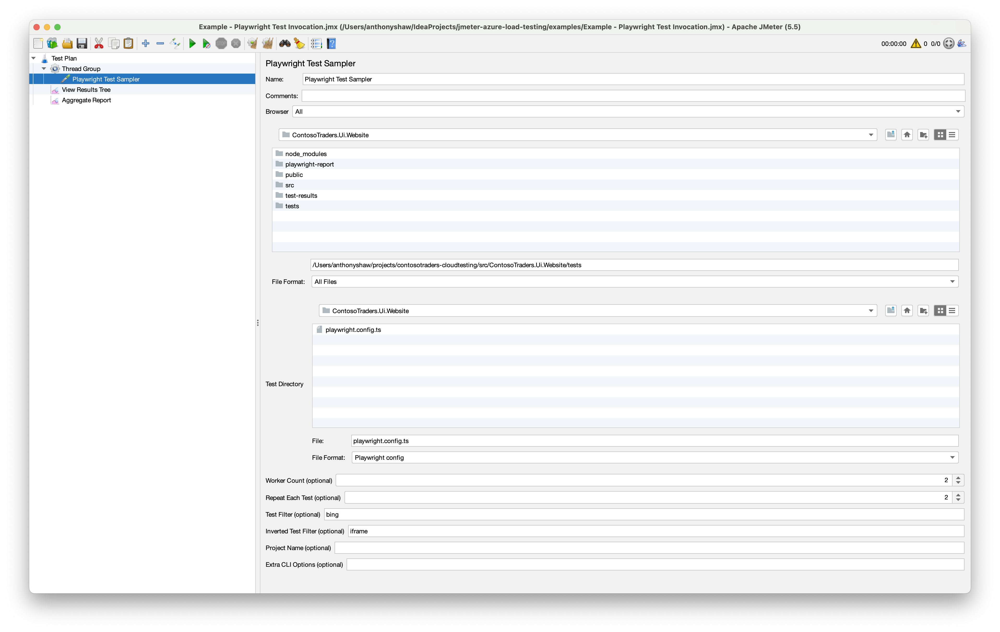

# jmeter-playwright

experimental JMeter Plugin to launch `playwright test` as a load test from JMeter and measure performance data.

Designed to be used to generate large load from a Playwright test generated using [codegen](https://playwright.dev/docs/codegen), [Playwright UI](https://playwright.dev/docs/test-ui-mode), or [Playwright's Visual Studio extensions](https://playwright.dev/docs/getting-started-vscode).

## Prerequisites

- Requires playwright to be installed and the `playwright install` process to have already been run
- Requires NodeJS
- Requires JMeter 5.1+
- A Playwright test suite

## Installation

Copy the JAR file from this site's [packages](https://github.com/tonybaloney/jmeter-playwright/packages) into your JMeter `lib/ext` directory and restart JMeter.

## Usage

Create a Thread Group within JMeter and add the "Playwright test sampler" to the thread group. This sampler executes Playwright test within a folder to run your playwright tests and converts the results into
JMeter Sample Results with timing. 

Configure all your Playwright options from inside JMeter:

Because a single sampler can run multiple tests, the Sample Results are captured as sub-results in a tree:

Each sample result represents a test case in Playwright test. The Load Time value is the time taken for that test case. 
